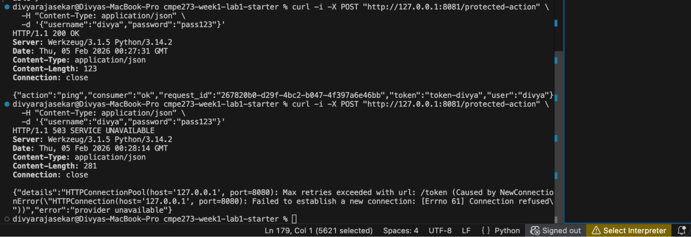
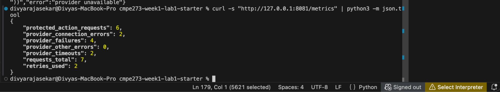
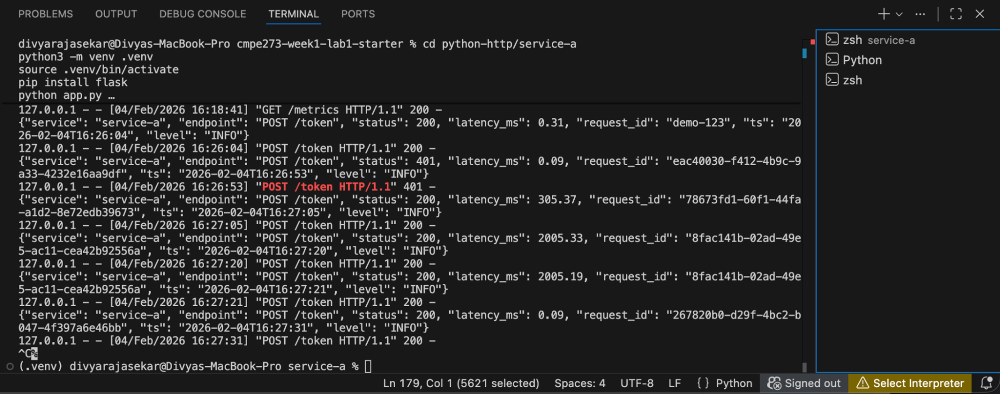
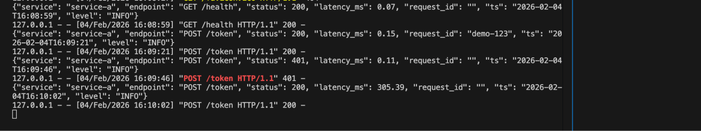
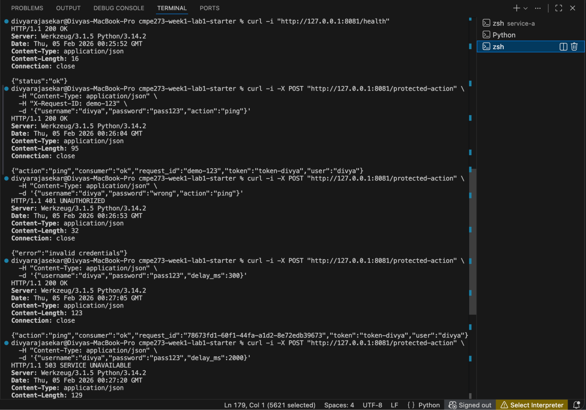
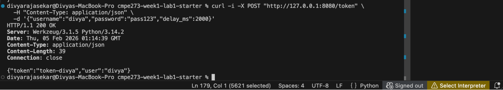
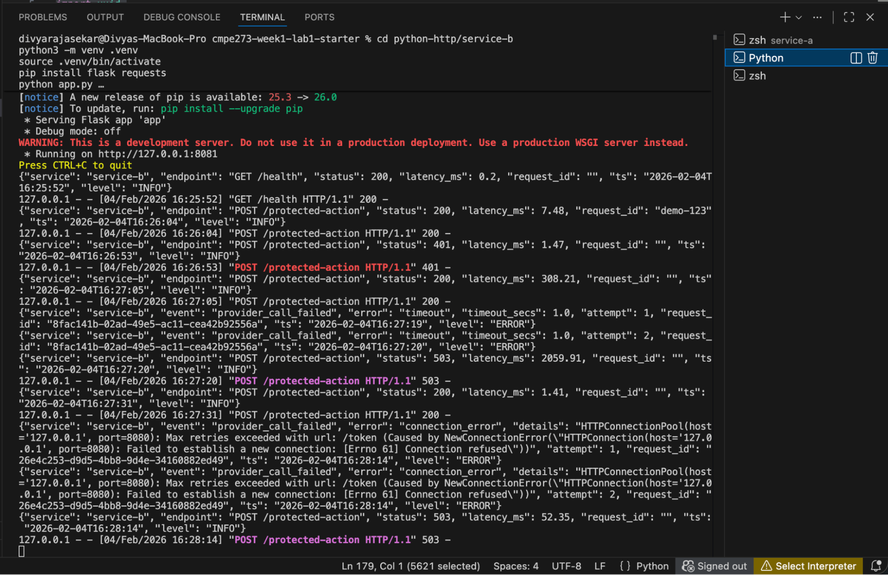
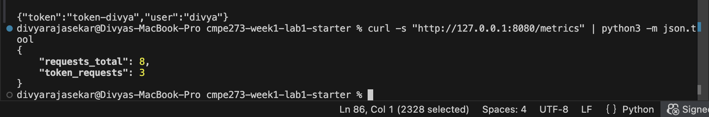
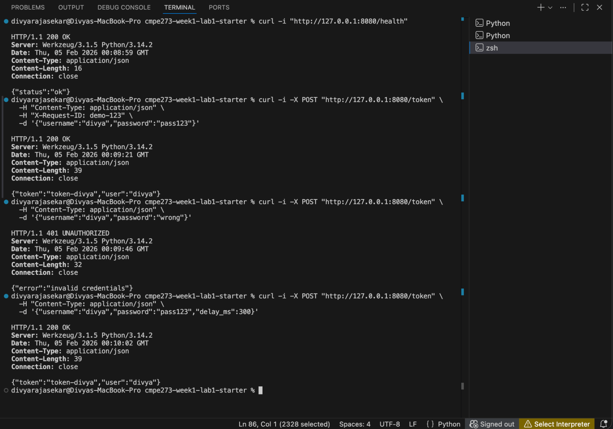

# **CMPE 273 – Week 1 Lab 1: Your First Distributed System (Starter)**

This is a tiny distributed system done on one laptop using **two independent services** that communicate over the network and can fail independently.

**Service A (Provider, localhost:8080)** exposes simple APIs: /health to show it’s running and a credential-based endpoint (POST /token) that returns a small, consistent JSON response (a deterministic token) with no database or persistent state. It also supports optional delay simulation (delay\_ms) to mimic a slow provider. 

**Service B (Consumer, localhost:8081)** exposes one main endpoint (POST /protected-action) that accepts a request, calls Service A over HTTP using a strict timeout, and returns a **combined response** that includes both the consumer’s result (action \+ request\_id) and the provider’s output (token/user).

Endpoints 

Service A (8080): GET /health, POST /token, GET /metrics

Service B (8081): GET /health, POST /protected-action, GET /metrics

**How to run locally**

Run service A   
Terminal 1:

cd python-http/service-a  
python3 \-m venv .venv  
source .venv/bin/activate  
pip install flask  
python app.py

Run Service B

Terminal 2:

cd python-http/service-b  
python3 \-m venv .venv  
source .venv/bin/activate  
pip install flask requests  
python app.py

**1\) Test /health**  
curl \-i "http://127.0.0.1:8080/health"

Output \- 

HTTP/1.1 200 OK

Server: Werkzeug/3.1.5 Python/3.14.2

Date: Thu, 05 Feb 2026 00:08:59 GMT

Content-Type: application/json

Content-Length: 16

Connection: close

{"status":"ok"}

Service A logs

{"service": "service-a", "endpoint": "GET /health", "status": 200, "latency\_ms": 0.07, "request\_id": "", "ts": "2026-02-04T16:08:59", "level": "INFO"}

127.0.0.1 \- \- \[04/Feb/2026 16:08:59\] "GET /health HTTP/1.1" 200 \-  
---

## **2\) Test /token success (correct credentials)**

curl \-i \-X POST "http://127.0.0.1:8080/token" \\  
  \-H "Content-Type: application/json" \\  
  \-H "X-Request-ID: demo-123" \\  
  \-d '{"username":"divya","password":"pass123"}'

Output

HTTP/1.1 200 OK

Server: Werkzeug/3.1.5 Python/3.14.2

Date: Thu, 05 Feb 2026 00:09:21 GMT

Content-Type: application/json

Content-Length: 39

Connection: close

{"token":"token-divya","user":"divya"}

Service A logs

{"service": "service-a", "endpoint": "POST /token", "status": 200, "latency\_ms": 0.15, "request\_id": "demo-123", "ts": "2026-02-04T16:09:21", "level": "INFO"}  
127.0.0.1 \- \- \[04/Feb/2026 16:09:21\] "POST /token HTTP/1.1" 200 \-  
---

## **3\) Test /token failure (wrong password)**

curl \-i \-X POST "http://127.0.0.1:8080/token" \\  
  \-H "Content-Type: application/json" \\  
  \-d '{"username":"divya","password":"wrong"}'

Output 

HTTP/1.1 401 UNAUTHORIZED

Server: Werkzeug/3.1.5 Python/3.14.2

Date: Thu, 05 Feb 2026 00:09:46 GMT

Content-Type: application/json

Content-Length: 32

Connection: close

{"error":"invalid credentials"}

Service A logs  
{"service": "service-a", "endpoint": "POST /token", "status": 401, "latency\_ms": 0.11, "request\_id": "", "ts": "2026-02-04T16:09:46", "level": "INFO"}

127.0.0.1 \- \- \[04/Feb/2026 16:09:46\] "POST /token HTTP/1.1" 401 \-  
---

## **4\) Test slow simulation (delay\_ms)**

### **Slow but still returns 200**

curl \-i \-X POST "http://127.0.0.1:8080/token" \\  
  \-H "Content-Type: application/json" \\  
  \-d '{"username":"divya","password":"pass123","delay\_ms":300}'  
Output   
HTTP/1.1 200 OK  
Server: Werkzeug/3.1.5 Python/3.14.2  
Date: Thu, 05 Feb 2026 00:10:02 GMT  
Content-Type: application/json  
Content-Length: 39  
Connection: close

{"token":"token-divya","user":"divya"}

Service A logs 

{"service": "service-a", "endpoint": "POST /token", "status": 200, "latency\_ms": 305.39, "request\_id": "", "ts": "2026-02-04T16:10:02", "level": "INFO"}  
127.0.0.1 \- \- \[04/Feb/2026 16:10:02\] "POST /token HTTP/1.1" 200 \-

### **Force a “very slow” provider (What happens when there is a timeout? - Timeout testing for Service B)**

curl \-i \-X POST "http://127.0.0.1:8080/token" \\  
  \-H "Content-Type: application/json" \\  
  \-d '{"username":"divya","password":"pass123","delay\_ms":2000}'

  
{"service": "service-b", "endpoint": "GET /metrics", "status": 200, "latency\_ms": 0.17, "request\_id": "", "ts": "2026-02-04T17:09:29", "level": "INFO"}  
127.0.0.1 \- \- \[04/Feb/2026 17:09:29\] "GET /metrics HTTP/1.1" 200 \-

## **5\) Test /metrics**

(Use python3 on Mac)

curl \-s "http://127.0.0.1:8080/metrics" | python3 \-m json.tool

Output \- divyarajasekar@Divyas-MacBook-Pro cmpe273-week1-lab1-starter % curl \-s "http://127.0.0.1:8080/metrics" | python3 \-m json.tool  
{  
    "requests\_total": 8,  
    "token\_requests": 3  
}  
divyarajasekar@Divyas-MacBook-Pro cmpe273-week1-lab1-starter %   
   
---

Full Screenshots below,  
  
  

## **1\) Test Service B /health**

Some full screenshots below,   
Service A   
   
Service B   
    
  
  

1. Test B health

curl \-i "http://127.0.0.1:8081/health"

Output 

HTTP/1.1 200 OK

Server: Werkzeug/3.1.5 Python/3.14.2

Date: Thu, 05 Feb 2026 00:25:52 GMT

Content-Type: application/json

Content-Length: 16

Connection: close

{"status":"ok"}

Service B logs 

{"service": "service-b", "endpoint": "GET /health", "status": 200, "latency\_ms": 0.2, "request\_id": "", "ts": "2026-02-04T16:25:52", "level": "INFO"}

127.0.0.1 \- \- \[04/Feb/2026 16:25:52\] "GET /health HTTP/1.1" 200 \-

---

## **2\) Test Service B success (B calls A and returns combined response)**

curl \-i \-X POST "http://127.0.0.1:8081/protected-action" \\  
  \-H "Content-Type: application/json" \\  
  \-H "X-Request-ID: demo-123" \\  
  \-d '{"username":"divya","password":"pass123","action":"ping"}'

Output 

HTTP/1.1 200 OK

Server: Werkzeug/3.1.5 Python/3.14.2

Date: Thu, 05 Feb 2026 00:26:04 GMT

Content-Type: application/json

Content-Length: 95

Connection: close

{"action":"ping","consumer":"ok","request\_id":"demo-123","token":"token-divya","user":"divya"}

Logs

Service B  
{"service": "service-b", "endpoint": "POST /protected-action", "status": 200, "latency\_ms": 7.48, "request\_id": "demo-123", "ts": "2026-02-04T16:26:04", "level": "INFO"}

127.0.0.1 \- \- \[04/Feb/2026 16:26:04\] "POST /protected-action HTTP/1.1" 200 \-

Service A

{"service": "service-a", "endpoint": "POST /token", "status": 200, "latency\_ms": 0.31, "request\_id": "demo-123", "ts": "2026-02-04T16:26:04", "level": "INFO"}

127.0.0.1 \- \- \[04/Feb/2026 16:26:04\] "POST /token HTTP/1.1" 200 \-

---

## **3\) Test invalid credentials**

curl \-i \-X POST "http://127.0.0.1:8081/protected-action" \\  
  \-H "Content-Type: application/json" \\  
  \-d '{"username":"divya","password":"wrong","action":"ping"}'

Output

HTTP/1.1 401 UNAUTHORIZED

Server: Werkzeug/3.1.5 Python/3.14.2

Date: Thu, 05 Feb 2026 00:26:53 GMT

Content-Type: application/json

Content-Length: 32

Connection: close

{"error":"invalid credentials"}

Logs

{"service": "service-b", "endpoint": "POST /protected-action", "status": 401, "latency\_ms": 1.47, "request\_id": "", "ts": "2026-02-04T16:26:53", "level": "INFO"}

127.0.0.1 \- \- \[04/Feb/2026 16:26:53\] "POST /protected-action HTTP/1.1" 401 \-

---

## **4\) Test provider slow but still OK (delay \< 1s timeout)**

curl \-i \-X POST "http://127.0.0.1:8081/protected-action" \\  
  \-H "Content-Type: application/json" \\  
  \-d '{"username":"divya","password":"pass123","delay\_ms":300}'

Output 

HTTP/1.1 200 OK

Server: Werkzeug/3.1.5 Python/3.14.2

Date: Thu, 05 Feb 2026 00:27:05 GMT

Content-Type: application/json

Content-Length: 123

Connection: close

{"action":"ping","consumer":"ok","request\_id":"78673fd1-60f1-44fa-a1d2-8e72edb39673","token":"token-divya","user":"divya"}

Logs

{"service": "service-b", "endpoint": "POST /protected-action", "status": 200, "latency\_ms": 308.21, "request\_id": "", "ts": "2026-02-04T16:27:05", "level": "INFO"}

127.0.0.1 \- \- \[04/Feb/2026 16:27:05\] "POST /protected-action HTTP/1.1" 200 \-

---

## **5\) Test provider timeout (delay \> 1s timeout → B returns 503\)**

curl \-i \-X POST "http://127.0.0.1:8081/protected-action" \\  
  \-H "Content-Type: application/json" \\  
  \-d '{"username":"divya","password":"pass123","delay\_ms":2000}'

Output 

HTTP/1.1 503 SERVICE UNAVAILABLE

Server: Werkzeug/3.1.5 Python/3.14.2

Date: Thu, 05 Feb 2026 00:27:20 GMT

Content-Type: application/json

Content-Length: 129

Connection: close

{"details":"HTTPConnectionPool(host='127.0.0.1', port=8080): Read timed out. (read timeout=1.0)","error":"provider unavailable"}

Logs

{"service": "service-b", "event": "provider\_call\_failed", "error": "timeout", "timeout\_secs": 1.0, "attempt": 1, "request\_id": "8fac141b-02ad-49e5-ac11-cea42b92556a", "ts": "2026-02-04T16:27:19", "level": "ERROR"}

{"service": "service-b", "event": "provider\_call\_failed", "error": "timeout", "timeout\_secs": 1.0, "attempt": 2, "request\_id": "8fac141b-02ad-49e5-ac11-cea42b92556a", "ts": "2026-02-04T16:27:20", "level": "ERROR"}

{"service": "service-b", "endpoint": "POST /protected-action", "status": 503, "latency\_ms": 2059.91, "request\_id": "", "ts": "2026-02-04T16:27:20", "level": "INFO"}

127.0.0.1 \- \- \[04/Feb/2026 16:27:20\] "POST /protected-action HTTP/1.1" 503 \-

---

## **6\) Test provider down / connection refused (What happens if Service A is down?\)**

1. Stop Service A (Terminal 1): **Ctrl+C**  
2. Now call B:

curl \-i \-X POST "http://127.0.0.1:8081/protected-action" \\  
  \-H "Content-Type: application/json" \\  
  \-d '{"username":"divya","password":"pass123"}'

Output   
HTTP/1.1 503 SERVICE UNAVAILABLE  
Server: Werkzeug/3.1.5 Python/3.14.2  
Date: Thu, 05 Feb 2026 00:28:14 GMT  
Content-Type: application/json  
Content-Length: 281  
Connection: close

{"details":"HTTPConnectionPool(host='127.0.0.1', port=8080): Max retries exceeded with url: /token (Caused by NewConnectionError(\\"HTTPConnection(host='127.0.0.1', port=8080): Failed to establish a new connection: \[Errno 61\] Connection refused\\"))","error":"provider unavailable"}

Logs

{"service": "service-b", "event": "provider\_call\_failed", "error": "connection\_error", "details": "HTTPConnectionPool(host='127.0.0.1', port=8080): Max retries exceeded with url: /token (Caused by NewConnectionError(\\"HTTPConnection(host='127.0.0.1', port=8080): Failed to establish a new connection: \[Errno 61\] Connection refused\\"))", "attempt": 1, "request\_id": "26e4c253-d9d5-4bb8-9d4e-34160882ed49", "ts": "2026-02-04T16:28:14", "level": "ERROR"}  
{"service": "service-b", "event": "provider\_call\_failed", "error": "connection\_error", "details": "HTTPConnectionPool(host='127.0.0.1', port=8080): Max retries exceeded with url: /token (Caused by NewConnectionError(\\"HTTPConnection(host='127.0.0.1', port=8080): Failed to establish a new connection: \[Errno 61\] Connection refused\\"))", "attempt": 2, "request\_id": "26e4c253-d9d5-4bb8-9d4e-34160882ed49", "ts": "2026-02-04T16:28:14", "level": "ERROR"}  
{"service": "service-b", "endpoint": "POST /protected-action", "status": 503, "latency\_ms": 52.35, "request\_id": "", "ts": "2026-02-04T16:28:14", "level": "INFO"}  
127.0.0.1 \- \- \[04/Feb/2026 16:28:14\] "POST /protected-action HTTP/1.1" 503 \-

---

## **8\) Test metrics endpoint**

curl \-s "http://127.0.0.1:8081/metrics" | python3 \-m json.tool

You’ll see counters increase as you test.

  

What makes this distributed?

What makes this system distributed is that it has **two separate services running as independent processes** (Service A on localhost:8080 and Service B on localhost:8081) that **communicate over the network** using HTTP requests. Even though both run on the same machine, they don’t share memory or state. Service B must call Service A over a network boundary and handle real distributed-system issues like **latency and partial failure**. If Service A is slow or down, Service B can still run but must detect **timeouts/connection errors**, return **503**, and log the failure, demonstrating **independent failure** and the need for **observability** (logs with service, endpoint, status, latency, and request\_id) to debug interactions across services.